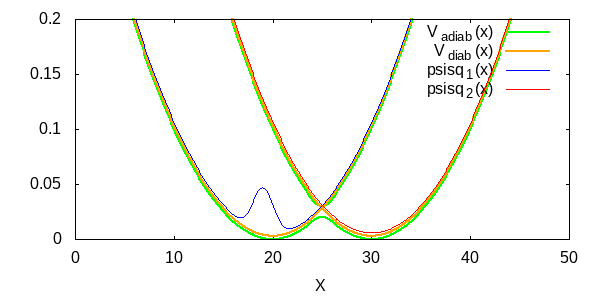

Multi surface Split-Operator Fourier Transform (MSOFT) program
for the course [Computational Methods in Molecular Quantum Mechanics CH-452](http://edu.epfl.ch/coursebook/en/computational-methods-in-molecular-quantum-mechanics-CH-452).

Original program written by Sara Bonella.

### HOW TO PLAY WITH IT:
- fork it
- clone it from your repository
- modify MSOFT.c, e.g.,
     - grid and time step settings
     - initial position and speed
     - mass
     - potential type (crossing surfaces, double harmonic)
- compile it with $make
- run MSOFT.x
- visualize the output .dat using gnuplot (e.g., $gnuplot psi.gnuplot)
- report any bug!

### EXAMPLE:
This is a gaussian wave packet, with a starting position and momentum, crossing a coupling region between two potential surfaces.

